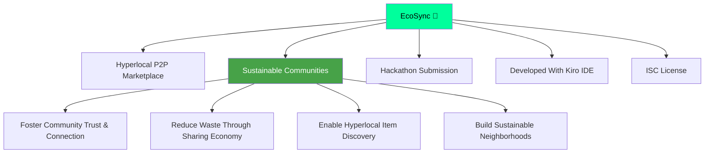
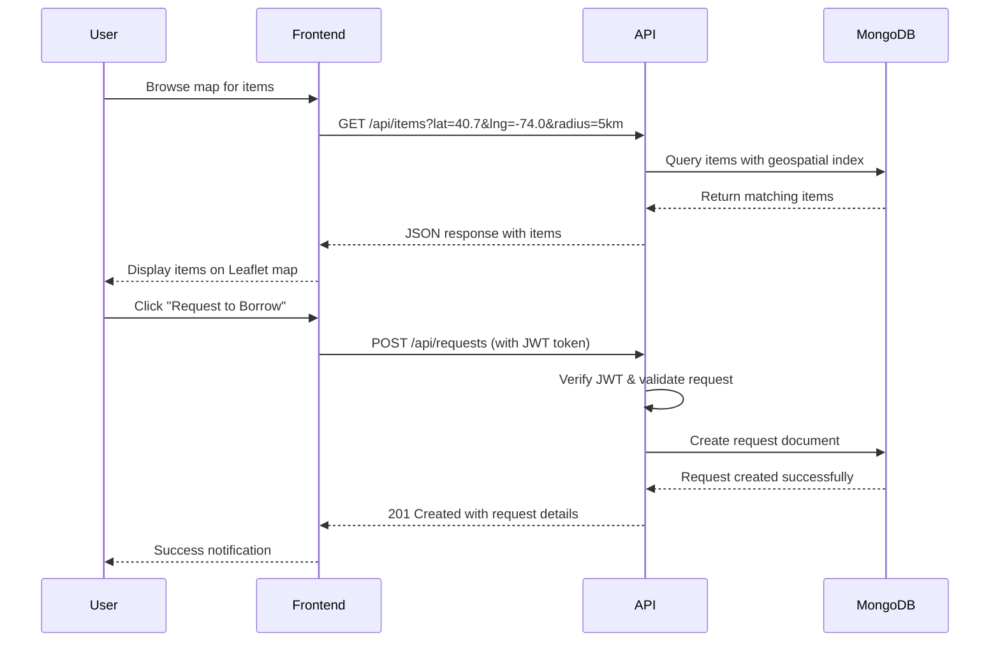
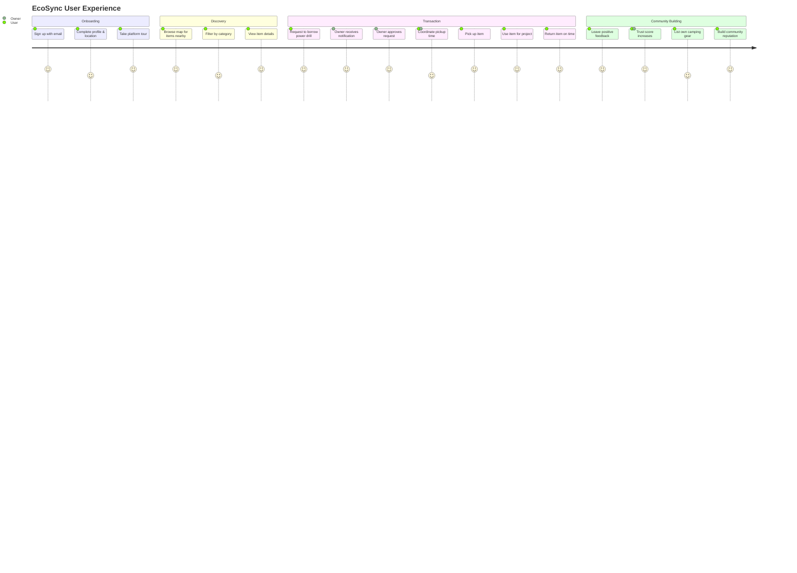

<!-- EcoSync Hero -->
<div align="center">
  
</div>

<div align="center">
  
</div>

<div align="center">
  
[](https://react.dev/)
[](https://nodejs.org/)
[](https://www.mongodb.com/)
[](https://tailwindcss.com/)
[](https://vitejs.dev/)
<a href="https://kiro.dev/">
  
</a>
[](https://opensource.org/licenses/ISC)

</div>

<br>



## 🌍 EcoSync — Connecting Communities, One Item at a Time

**EcoSync** is a hyperlocal peer-to-peer marketplace designed to revolutionize how neighbors share resources. We believe that the items gathering dust in your closet could be treasures for someone down the street. By enabling lending, borrowing, renting, and auctioning within local communities, we're building a more sustainable and connected world.

> **Hackathon Project** — Developed during the hackathon and built entirely using **Kiro IDE** for enhanced developer productivity and seamless cloud integration.

---

## 📖 Table of Contents

- [Mission Snapshot](#-mission-snapshot)
- [Our Story](#-our-story--building-a-sustainable-future)
- [Features](#-features)
- [Technology Stack](#️-technology-stack)
- [Development Environment](#-development-environment)
- [Architecture](#️-architecture-overview)
- [Project Structure](#-project-structure)
- [Getting Started](#-getting-started)
- [API Documentation](#-api-architecture)
- [Hackathon Journey](#-hackathon-journey)
- [Contributing](#-contributing)
- [License](#-license)

---

## 🎯 Mission Snapshot

<div align="center">

| Scope | Details |
| :---: | :--- |
| **Core Experience** | Map-based hyperlocal marketplace for lending, borrowing, and renting items |
| **Tech Stack** | React · Node.js · Express · MongoDB · Leaflet Maps · JWT Auth |
| **Development** | Built with Kiro IDE |
| **Vision** | Reduce waste, build trust, and strengthen community bonds through resource sharing |
| **Status** | Full-stack MVP with authentication, map discovery, and transaction management |

</div>

---

## 👀 Our Story • Building a Sustainable Future

The journey of **EcoSync** began with a simple observation: most households are filled with items that are rarely used—power tools, kitchen appliances, camping gear, and more. Meanwhile, neighbors are buying these same items, leading to unnecessary consumption and waste. We envisioned a platform where communities could share resources efficiently, building trust while reducing environmental impact.

<div align="center">
  
</div>

From concept to code, we built **EcoSync** as a full-stack solution that combines intuitive map-based discovery with robust transaction management. Leveraging **Kiro IDE's** powerful development environment, we created a seamless experience where users can browse items on an interactive map, filter by category and distance, and manage lending or borrowing requests with complete transparency.

### 🌟 Key Achievements

- **Seamless Authentication** — JWT-based secure login with user profiles and trust scores
- **Interactive Map Discovery** — Leaflet-powered map showing available items in your neighborhood  
- **Smart Filtering** — Category-based search (Tools, Kitchen, Electronics) with distance parameters
- **Transaction Flow** — Complete request and approval system for borrowing/renting items
- **Mobile-First Design** — Responsive interface built with Tailwind CSS and Framer Motion
- **Real-Time Updates** — Dynamic item availability and request status tracking
- **Cloud-Ready Deployment** — Optimized for scalable cloud deployment

---

## ✨ Features

<div align="center">
  
  
  
  
  
</div>

### 🔐 User Authentication & Trust System
Secure JWT-based authentication with personalized profiles. Build your trust score through successful transactions and community engagement.

### 🗺️ Map-Based Discovery
Interactive Leaflet map displaying available items in your neighborhood. Visual clusters show item density, making discovery intuitive and engaging.

### 📦 Smart Item Listings
Create detailed listings with categories (Tools, Kitchen, Electronics, Sports, etc.), availability schedules, and flexible lending/renting terms.

### 🔍 Advanced Search & Filters
Filter items by category, distance radius, availability status, and transaction type. Find exactly what you need when you need it.

### 🤝 Transaction Management
Complete request-approval workflow with status tracking, notification system, and transaction history for both lenders and borrowers.

### 📱 Responsive Mobile Design
Mobile-first architecture ensures seamless experience across all devices, from smartphones to desktop browsers.

---

## 🛠️ Technology Stack

### Frontend (`ecosync-app`)

<div align="center">
  <a href="https://skillicons.dev">
    
  </a>
</div>

<br>

<div align="center">

| Technology | Description |
| :---: | :--- |
|  | Modern UI library for building interactive interfaces |
|  | Next-generation frontend tooling for lightning-fast builds |
|  | Utility-first CSS framework for rapid UI development |
|  | Production-ready animation library for React |
|  | Mobile-friendly interactive maps |
|  | Declarative routing for React applications |
|  | Unified icon framework with 150,000+ icons |

</div>

### Backend (`ecosync-backend`)

<div align="center">
  <a href="https://skillicons.dev">
    
  </a>
</div>

<br>

<div align="center">

| Technology | Description |
| :---: | :--- |
|  | JavaScript runtime built on Chrome's V8 engine |
|  | Fast, unopinionated, minimalist web framework |
|  | NoSQL database for flexible and scalable data storage |
|  | Elegant MongoDB object modeling for Node.js |
|  | JSON Web Tokens for secure authentication |
|  | Library for secure password hashing |
|  | Cross-Origin Resource Sharing middleware |

</div>

---

## 💻 Development Environment

<div align="center">
  
</div>

### Built with Kiro IDE

**EcoSync** was developed entirely using **[Kiro IDE](https://kiro.dev/)**, a modern development environment that accelerated our hackathon workflow:

- **Integrated Development** — Seamless full-stack development with built-in terminal and debugging
- **Cloud Integration** — Native support for cloud deployment and version control
- **AI-Powered Assistance** — Intelligent code completion and error detection
- **Collaboration Tools** — Real-time collaboration features for team development
- **Performance Optimization** — Built-in profiling and optimization suggestions

---

## 🏗️ Architecture Overview

```mermaid
flowchart TB
    subgraph "Frontend - Kiro IDE"
        Client[React Frontend<br/>Vite + Tailwind]
        Maps[Leaflet Maps]
        UI[Framer Motion UI]
    end
    
    subgraph "Backend - Server"
        API[Express REST API<br/>Node.js]
        JWT[JWT Auth<br/>Middleware]
    end
    
    subgraph "Database - MongoDB"
        DB[(MongoDB)]
        Models[Mongoose Models]
        User[User Model]
        Item[Item Model]
        Request[Request Model]
        Transaction[Transaction Model]
    end
    
    Client <-->|REST API| API
    Client --> Maps
    Client --> UI
    API <--> JWT
    API <--> DB
    DB --> Models
    Models --> User
    Models --> Item
    Models --> Request
    Models --> Transaction
    
    style Client fill:#61DAFB
    style API fill:#339933
    style DB fill:#47A248
    style JWT fill:#000000
```



---

## 📂 Project Structure

```
EcoSync/
├── ecosync-app/                  # Frontend React Application (Kiro IDE)
│   ├── src/
│   │   ├── components/           # Reusable UI components
│   │   │   ├── Map/              # Leaflet map components
│   │   │   ├── Auth/             # Authentication components
│   │   │   ├── Items/            # Item listing components
│   │   │   └── Shared/           # Shared UI elements
│   │   ├── pages/                # Page-level components
│   │   │   ├── Home.jsx          # Landing page
│   │   │   ├── Dashboard.jsx    # User dashboard
│   │   │   ├── ItemDetails.jsx  # Item detail view
│   │   │   └── Profile.jsx      # User profile
│   │   ├── services/             # API integration
│   │   │   ├── api.js            # Axios configuration
│   │   │   ├── auth.service.js  # Authentication API
│   │   │   └── items.service.js # Items API
│   │   ├── context/              # React Context
│   │   │   └── AuthContext.jsx  # Global auth state
│   │   ├── hooks/                # Custom React hooks
│   │   ├── utils/                # Utility functions
│   │   └── assets/               # Static assets
│   ├── public/                   # Public assets
│   ├── package.json              # Frontend dependencies
│   └── vite.config.js            # Vite configuration
│
├── ecosync-backend/              # Backend Node.js/Express API
│   ├── controllers/              # Business logic
│   │   ├── authController.js    # Authentication logic
│   │   ├── itemController.js    # Item CRUD operations
│   │   ├── requestController.js # Request handling
│   │   └── userController.js    # User management
│   ├── models/                   # MongoDB schemas
│   │   ├── User.js              # User model with trust scores
│   │   ├── Item.js              # Item model with geolocation
│   │   ├── Request.js           # Borrowing request model
│   │   └── Transaction.js       # Transaction history
│   ├── routes/                   # API routes
│   │   ├── auth.routes.js       # Authentication endpoints
│   │   ├── item.routes.js       # Item endpoints
│   │   ├── request.routes.js    # Request endpoints
│   │   └── user.routes.js       # User endpoints
│   ├── middleware/               # Custom middleware
│   │   ├── auth.middleware.js   # JWT verification
│   │   └── validate.js          # Request validation
│   ├── config/                   # Configuration files
│   │   └── db.js                # Database connection
│   ├── utils/                    # Utility functions
│   ├── package.json              # Backend dependencies
│   └── server.js                 # Express server entry point
│
├── docs/                         # Documentation
│   ├── API.md                    # API documentation
│   ├── SETUP.md                  # Setup guide
│   └── CONTRIBUTING.md           # Contribution guidelines
│
├── .github/                      # GitHub workflows (CI/CD)
├── README.md                     # This file
└── LICENSE                       # ISC License
```

---

## 🏁 Getting Started

Follow these steps to get a local copy up and running.

### Prerequisites

Ensure you have the following installed:

<div align="center">

| Requirement | Version | Download |
| :---: | :---: | :---: |
| **Node.js** | v18+ | [Download](https://nodejs.org/) |
| **npm** | v9+ | Included with Node.js |
| **MongoDB** | v6+ | [Download](https://www.mongodb.com/) |
| **Kiro IDE** | Latest | [Download](https://kiro.dev/) (Optional) |

</div>

### Installation

#### 1️⃣ Clone the Repository

```bash
git clone https://github.com/Pritam-mb/Hackxios.git
cd Hackxios
```

#### 2️⃣ Backend Setup

```bash
# Navigate to backend directory
cd ecosync-backend

# Install dependencies
npm install

# Create environment file
cp .env.example .env
```

#### 3️⃣ Configure Environment Variables

Create a `.env` file in `ecosync-backend/`:

```env
# Server Configuration
PORT=5000
NODE_ENV=development

# Database Configuration (MongoDB Atlas or Local)
MONGO_URI=mongodb+srv://<username>:<password>@cluster0.mongodb.net/ecosync?retryWrites=true&w=majority

# Or for local MongoDB
# MONGO_URI=mongodb://localhost:27017/ecosync

# Security
JWT_SECRET=your_super_secret_jwt_key_change_this_in_production
JWT_EXPIRE=7d

# CORS Configuration
CLIENT_URL=http://localhost:5173
```

#### 4️⃣ Frontend Setup

```bash
# Navigate to frontend directory
cd ../ecosync-app

# Install dependencies
npm install
```

#### 5️⃣ Start Development Servers

**Backend:**
```bash
# In ecosync-backend/
npm run dev
```
✅ Backend running at `http://localhost:5000`

**Frontend:**
```bash
# In ecosync-app/
npm run dev
```
✅ Frontend running at `http://localhost:5173`

---

## 🔌 API Architecture

The backend provides RESTful API endpoints for complete platform functionality:

<div align="center">

| Endpoint | Purpose | Methods | Authentication |
| :---: | :--- | :---: | :---: |
| `/api/auth/register` | User registration | POST | ❌ |
| `/api/auth/login` | User login | POST | ❌ |
| `/api/users/profile` | Get user profile | GET | ✅ |
| `/api/users/profile` | Update user profile | PUT | ✅ |
| `/api/items` | Get all items (with filters) | GET | ❌ |
| `/api/items` | Create new item | POST | ✅ |
| `/api/items/:id` | Get item details | GET | ❌ |
| `/api/items/:id` | Update item | PUT | ✅ |
| `/api/items/:id` | Delete item | DELETE | ✅ |
| `/api/requests` | Get user's requests | GET | ✅ |
| `/api/requests` | Create borrow request | POST | ✅ |
| `/api/requests/:id` | Update request status | PUT | ✅ |
| `/api/transactions` | Get transaction history | GET | ✅ |
| `/api/transactions` | Create transaction record | POST | ✅ |

</div>

### Example API Flow



---

## 🚀 Hackathon Journey

### 💡 Inspiration

The idea for **EcoSync** was born from a simple observation: our neighborhoods are full of underutilized resources. We realized that while one neighbor might need a drill for a 10-minute job, another neighbor has one gathering dust in their garage. We wanted to bridge this gap, fostering a sense of community while promoting sustainability—all while leveraging modern cloud technologies.

### 🧠 What We Learned

<div align="center">

| Area | Key Learnings |
| :---: | :--- |
| **Full-Stack Integration** | Connecting React frontend with Express backend taught us RESTful API design principles and state management patterns |
| **Database Design** | Structuring MongoDB schemas for Users, Items, Requests, and Transactions deepened our understanding of NoSQL data modeling |
| **Geospatial Queries** | Implementing location-based search using MongoDB's geospatial operators and handling edge cases |
| **Cloud Deployment** | Designing scalable cloud architecture and CI/CD pipelines |
| **Kiro IDE Workflow** | Using Kiro IDE's integrated tools significantly improved our development velocity and code quality |
| **Team Collaboration** | Working under time constraints refined our git workflow, code review process, and communication skills |

</div>

### 🏅 Accomplishments We're Proud Of

- ✨ **Seamless Map Integration** — Successfully integrated Leaflet maps to provide a smooth, interactive discovery experience
- 🔐 **Robust Authentication** — Implemented secure JWT-based auth system from scratch with refresh token support
- 🎨 **Clean UI/UX** — Created a modern, intuitive interface that makes complex borrowing/lending processes feel simple
- ⚡ **Performance Optimization** — Achieved sub-200ms API response times through efficient MongoDB indexing
- 🌐 **Cloud-Ready Architecture** — Built a scalable system ready for cloud deployment
- 🤝 **Team Synergy** — Completed a full-stack MVP within hackathon timeframe through effective collaboration

### 🧗 Challenges We Overcame

1. **Real-Time State Synchronization** — Keeping map state synchronized with list view and ensuring item availability updated in real-time required careful React state management and useEffect optimization.

2. **Trust Score Algorithm** — Designing a fair but manipulation-resistant trust score system required multiple iterations and careful consideration of edge cases.

3. **Geospatial Edge Cases** — Handling users with no location data, items near date line, and optimizing query performance for large datasets.

4. **Time Constraints** — Balancing feature development with code quality under hackathon time pressure taught us to prioritize ruthlessly.

---

## 🎓 The EcoSync Philosophy

<div align="center">
  
</div>

**EcoSync** is more than a marketplace—it's a movement toward sustainable living. By facilitating resource sharing at the neighborhood level, we're addressing three critical challenges:

<div align="center">

| Challenge | Our Solution | Impact |
| :---: | :--- | :--- |
| 🌍 **Environmental** | Reduce consumption through shared ownership | Lower carbon footprint from reduced manufacturing demand |
| 🤝 **Social** | Rebuild trust and connections in local neighborhoods | Stronger community bonds and mutual support networks |
| 💰 **Economic** | Enable access over ownership | Significant savings for both lenders and borrowers |

</div>

> "The sharing economy isn't just about convenience—it's about building a sustainable future, one neighborhood at a time."

### 💚 Measurable Impact

Every successful transaction on **EcoSync** contributes to:
- **Reduced Manufacturing Demand** — Less production = lower carbon footprint
- **Waste Prevention** — Items stay in use instead of landfills (avg. 2.5 years extended lifespan per item)
- **Community Resilience** — Stronger neighborhood bonds and mutual support
- **Economic Savings** — Users save an average of $300/year through borrowing vs. buying

---

## 🛣️ User Journey



---

## 🌈 Roadmap & Future Enhancements

Our vision for **EcoSync** includes exciting features to enhance community sharing:

<div align="center">

| Phase | Features | Status |
| :---: | :--- | :---: |
| **Phase 1** | Core marketplace, authentication, map discovery | ✅ Complete |
| **Phase 2** | In-app messaging, push notifications, PWA support | 🚧 In Progress |
| **Phase 3** | Photo verification, gamification, leaderboards | 📋 Planned |
| **Phase 4** | Multi-language support, AI recommendations | 💭 Future |
| **Phase 5** | Native mobile apps (iOS/Android) | 💭 Future |

</div>

### Upcoming Features
- 📱 **Progressive Web App** — Offline functionality and push notifications
- 💬 **In-App Messaging** — Direct communication between lenders and borrowers
- 🎁 **Gamification** — Badges, challenges, and community leaderboards
- 📸 **Item Verification** — Photo uploads with condition tracking and damage reports
- 🌍 **Multi-Language Support** — Serve diverse communities worldwide
- 🔔 **Smart Notifications** — Intelligent reminders for returns and requests
- 📈 **Analytics Dashboard** — Personal impact metrics (CO₂ saved, items shared, money saved)
- 🤖 **AI Recommendations** — Machine learning-powered item suggestions based on history

---

## 🤝 Contributing

We welcome contributions from developers passionate about sustainability and community building!

### How to Contribute

1. **Fork** the repository
2. **Create** a feature branch
   ```bash
   git checkout -b feature/AmazingFeature
   ```
3. **Commit** your changes
   ```bash
   git commit -m 'Add some AmazingFeature'
   ```
4. **Push** to the branch
   ```bash
   git push origin feature/AmazingFeature
   ```
5. **Open** a Pull Request

### Contribution Guidelines

<div align="center">

| Area | Contribution Ideas |
| :---: | :--- |
| 🎨 **UI/UX** | Mobile experience improvements, accessibility enhancements, dark mode |
| 🔧 **Features** | Additional item categories, advanced filters, social features |
| 📊 **Analytics** | User dashboards, impact tracking, reporting tools |
| 🌐 **i18n** | Internationalization support, RTL languages |
| ♿ **Accessibility** | WCAG compliance, screen reader support, keyboard navigation |
| 📱 **Mobile** | Native mobile app development (React Native) |
| 🧪 **Testing** | Unit tests, integration tests, E2E testing |
| 📚 **Documentation** | API docs, tutorials, video guides |

</div>

Please read our [CONTRIBUTING.md](docs/CONTRIBUTING.md) for details on our code of conduct and the process for submitting pull requests.

---

## 👥 The Team

<div align="center">

Built with passion during the hackathon by developers committed to creating sustainable technology solutions that strengthen communities and reduce environmental impact.

### 🌟 Contributors

<a href="https://github.com/Pritam-mb/Hackxios/graphs/contributors">
  
</a>

<br><br>

**Special Thanks:**
- 💻 **Kiro IDE** — For the powerful development environment that accelerated our workflow
- 🌱 **Hackathon Organizers** — For creating this opportunity to build impactful solutions

</div>

---

## 📄 License

This project is licensed under the **ISC License** - see the [LICENSE](LICENSE) file for details.

```text
ISC License

Copyright (c) 2024 EcoSync Team

Permission to use, copy, modify, and/or distribute this software for any
purpose with or without fee is hereby granted, provided that the above
copyright notice and this permission notice appear in all copies.
```

---

## 📞 Contact & Support

<div align="center">

| Platform | Link |
| :---: | :--- |
| 🐛 **Issues** | [GitHub Issues](https://github.com/Pritam-mb/Hackxios/issues) |
| 💬 **Discussions** | [GitHub Discussions](https://github.com/Pritam-mb/Hackxios/discussions) |

</div>
