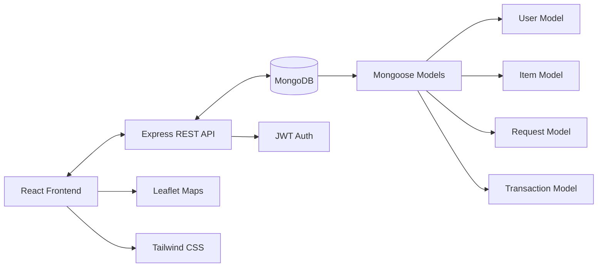
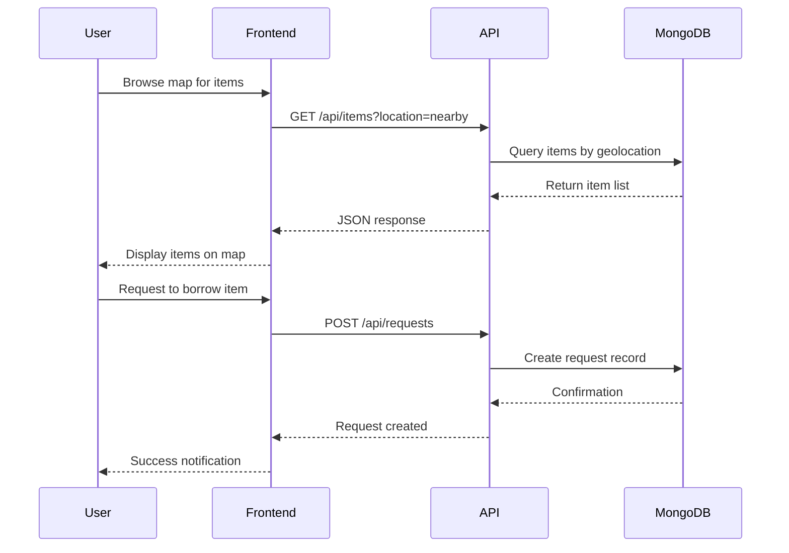
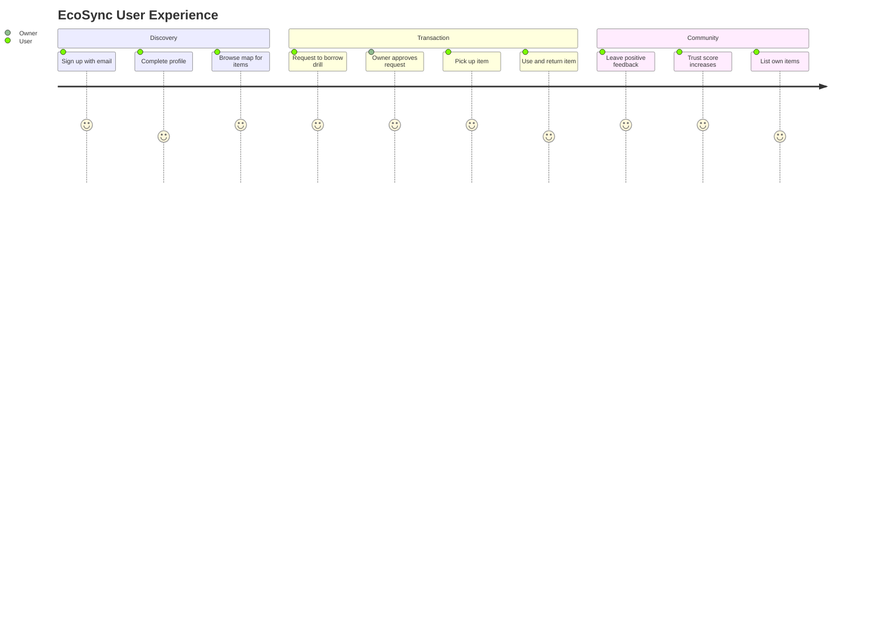

<!-- EcoSync Hero -->
<div align="center">
  
</div>

<div align="center">
  
</div>

<div align="center">
  
[](https://react.dev/)
[](https://nodejs.org/)
[](https://www.mongodb.com/)
[](https://tailwindcss.com/)

</div>

<br>

```text
╔══════════════════════════════════════╗
║  PROJECT: EcoSync 🌱                 ║
║  TYPE: Hyperlocal P2P Marketplace    ║
║  MISSION: Sustainable Communities    ║
║  STATUS: Active Development          ║
║  LICENSE: ISC                        ║
╚══════════════════════════════════════╝
   
🎯 MISSION OBJECTIVES:
   └─ Foster Community Trust & Connection
   └─ Reduce Waste Through Sharing Economy
   └─ Enable Hyperlocal Item Discovery
   └─ Build Sustainable Neighborhoods
```

## 🌍 EcoSync — Connecting Communities, One Item at a Time

**EcoSync** is a hyperlocal peer-to-peer marketplace designed to revolutionize how neighbors share resources. We believe that the items gathering dust in your closet could be treasures for someone down the street. By enabling lending, borrowing, renting, and auctioning within local communities, we're building a more sustainable and connected world.

## 🎯 Mission Snapshot

| Scope | Details |
| --- | --- |
| Core Experience | Map-based hyperlocal marketplace for lending, borrowing, and renting items |
| Tech Stack | React · Node.js · Express · MongoDB · Leaflet Maps · JWT Auth |
| Vision | Reduce waste, build trust, and strengthen community bonds through resource sharing |
| Status | Full-stack MVP with authentication, map discovery, and transaction management |

---

## 👀 Our Story • Building a Sustainable Future

The journey of **EcoSync** began with a simple observation: most households are filled with items that are rarely used—power tools, kitchen appliances, camping gear, and more. Meanwhile, neighbors are buying these same items, leading to unnecessary consumption and waste. We envisioned a platform where communities could share resources efficiently, building trust while reducing environmental impact.

<div align="center">
  
</div>

From concept to code, we built **EcoSync** as a full-stack solution that combines intuitive map-based discovery with robust transaction management. Users can browse items on an interactive map, filter by category and distance, and manage lending or borrowing requests with complete transparency. Every feature is designed to make sharing as effortless as possible.

### 🌟 Key Achievements

- **Seamless Authentication** — JWT-based secure login with user profiles and trust scores
- **Interactive Map Discovery** — Leaflet-powered map showing available items in your neighborhood  
- **Smart Filtering** — Category-based search (Tools, Kitchen, Electronics) with distance parameters
- **Transaction Flow** — Complete request and approval system for borrowing/renting items
- **Mobile-First Design** — Responsive interface built with Tailwind CSS and Framer Motion
- **Real-Time Updates** — Dynamic item availability and request status tracking

---

## 🛠️ Technology Stack

<div align="center">


</div>

### Frontend (`ecosync-app`)
- **Framework** — [React](https://react.dev/) with [Vite](https://vitejs.dev/) for lightning-fast builds
- **Styling** — [Tailwind CSS](https://tailwindcss.com/) for modern, responsive design
- **Animations** — [Framer Motion](https://www.framer.com/motion/) for smooth transitions
- **Maps** — [Leaflet](https://leafletjs.com/) & [React Leaflet](https://react-leaflet.js.org/) for interactive geospatial features
- **Routing** — [React Router DOM](https://reactrouter.com/) for seamless navigation
- **Icons** — [Iconify](https://iconify.design/) for scalable vector icons

### Backend (`ecosync-backend`)
- **Runtime** — [Node.js](https://nodejs.org/) for scalable server-side JavaScript
- **Framework** — [Express.js](https://expressjs.com/) for robust API architecture
- **Database** — [MongoDB](https://www.mongodb.com/) with [Mongoose](https://mongoosejs.com/) ODM
- **Authentication** — JWT (JSON Web Tokens) & Bcrypt for secure user management
- **CORS** — Cross-Origin Resource Sharing for frontend-backend communication

---

## ✨ Feature Showcase

<div align="center">
  
  
  
  
  
</div>

### 🔐 User Authentication & Trust System
Secure JWT-based authentication with personalized profiles. Build your trust score through successful transactions and community engagement.

### 🗺️ Map-Based Discovery
Interactive Leaflet map displaying available items in your neighborhood. Visual clusters show item density, making discovery intuitive and engaging.

### 📦 Smart Item Listings
Create detailed listings with categories (Tools, Kitchen, Electronics, Sports, etc.), availability schedules, and flexible lending/renting terms.

### 🔍 Advanced Search & Filters
Filter items by category, distance radius, availability status, and transaction type. Find exactly what you need when you need it.

### 🤝 Transaction Management
Complete request-approval workflow with status tracking, notification system, and transaction history for both lenders and borrowers.

### 📱 Responsive Mobile Design
Mobile-first architecture ensures seamless experience across all devices, from smartphones to desktop browsers.

---

## 🏗️ Architecture Overview



## 📂 Project Structure

```
Hackxios/
├── ecosyc/
│   ├── ecosync-app/              # Frontend React Application
│   │   ├── src/
│   │   │   ├── components/       # Reusable UI components
│   │   │   ├── pages/            # Page-level components
│   │   │   ├── services/         # API integration
│   │   │   ├── context/          # React Context (Auth)
│   │   │   └── assets/           # Static assets
│   │   └── public/               # Public assets
│   │
│   └── ecosync-backend/          # Backend Node.js/Express API
│       ├── controllers/          # Business logic
│       ├── models/               # MongoDB schemas
│       ├── routes/               # API routes
│       ├── middleware/           # Auth & validation
│       └── config/               # Database configuration
│
└── README.md                     # Project Documentation
```

---

## 🏁 Getting Started

### Prerequisites
- **Node.js** (v16 or higher)
- **npm** or **yarn**
- **MongoDB** (Local installation or Atlas connection string)

### 🚀 Quick Start Guide

#### 1️⃣ Backend Setup

Navigate to the backend directory:
```bash
cd ecosyc/ecosync-backend
```

Install dependencies:
```bash
npm install
```

Create a `.env` file in the `ecosync-backend` directory:
```env
PORT=5000
MONGO_URI=your_mongodb_connection_string
JWT_SECRET=your_jwt_secret_key
```

Start the development server:
```bash
npm run dev
```
✅ Backend running at `http://localhost:5000`

---

#### 2️⃣ Frontend Setup

Navigate to the frontend directory:
```bash
cd ecosyc/ecosync-app
```

Install dependencies:
```bash
npm install
```

Start the development server:
```bash
npm run dev
```
✅ Frontend running at `http://localhost:5173`

---

## 🔌 API Architecture

The backend provides RESTful API endpoints for complete platform functionality:

| Endpoint | Purpose | Methods |
|----------|---------|---------|
| `/api/auth` | User authentication (Login, Register) | POST |
| `/api/users` | Profile management and trust scores | GET, PUT |
| `/api/items` | Item CRUD operations | GET, POST, PUT, DELETE |
| `/api/requests` | Borrow/Rent request handling | GET, POST, PUT |
| `/api/transactions` | Transaction history and tracking | GET, POST |

### Example API Flow


---

## 💡 Key Features Deep Dive

### 🌟 Spotlight: Map-Based Discovery

The heart of **EcoSync** is the interactive map powered by Leaflet. Users can:
- **Pan & Zoom** to explore their neighborhood
- **Click markers** to see item details in real-time
- **Filter by radius** to control discovery range
- **Cluster view** for areas with high item density

<div align="center">
  
</div>

### 🏆 Trust Score System

Build community reputation through:
- Successful transactions (+10 points)
- Timely returns (+5 points)
- Positive feedback from peers (+15 points)
- Item condition maintenance (+8 points)

---

## 🎓 The EcoSync Philosophy

**EcoSync** is more than a marketplace—it's a movement toward sustainable living. By facilitating resource sharing at the neighborhood level, we're addressing three critical challenges:

1. **Environmental Impact** — Reducing consumption and waste through shared ownership
2. **Community Connection** — Rebuilding trust and relationships in local neighborhoods  
3. **Economic Efficiency** — Enabling access over ownership, saving money for everyone

Every transaction on **EcoSync** represents a small victory for sustainability and community building.

---

## 🛣️ User Journey



---

## 🤝 Contributing

We welcome contributions from developers passionate about sustainability and community building!

### How to Contribute

1. **Fork** the repository
2. **Create** a feature branch (`git checkout -b feature/AmazingFeature`)
3. **Commit** your changes (`git commit -m 'Add some AmazingFeature'`)
4. **Push** to the branch (`git push origin feature/AmazingFeature`)
5. **Open** a Pull Request

### Contribution Ideas
- 🎨 UI/UX improvements for mobile experience
- 🔧 Additional item categories and filters
- 📊 Analytics dashboard for users
- 🌐 Internationalization support
- ♿ Accessibility enhancements
- 📱 Native mobile app development

---

## 🌈 What's Next

Our roadmap for **EcoSync** includes exciting features to enhance community sharing:

- **📱 Progressive Web App** — Offline functionality and push notifications
- **💬 In-App Messaging** — Direct communication between lenders and borrowers
- **🎁 Gamification** — Badges, challenges, and community leaderboards
- **📸 Item Verification** — Photo uploads with condition tracking
- **🌍 Multi-Language Support** — Serve diverse communities worldwide
- **🔔 Smart Notifications** — Intelligent reminders for returns and requests
- **📈 Analytics Dashboard** — Personal impact metrics (CO₂ saved, items shared)

---

## 👥 The Team

Built with passion by developers committed to creating sustainable technology solutions that strengthen communities and reduce environmental impact.

---

## 💚 Impact Vision

<div align="center">
  
</div>

Every successful transaction on **EcoSync** contributes to:
- **Reduced Manufacturing Demand** — Less production = lower carbon footprint
- **Waste Prevention** — Items stay in use instead of landfills
- **Community Resilience** — Stronger neighborhood bonds and mutual support
- **Economic Savings** — Access to tools and items without ownership costs

> "The sharing economy isn't just about convenience—it's about building a sustainable future, one neighborhood at a time."

---

## 📄 License

This project is licensed under the **ISC License**.

---

<div align="center">
  
</div>

**EcoSync** proves that technology can bring communities together while protecting our planet. From local neighborhoods to global impact—we're building a sustainable sharing economy, one item at a time. 🌱

<div align="center">
  
</div>
