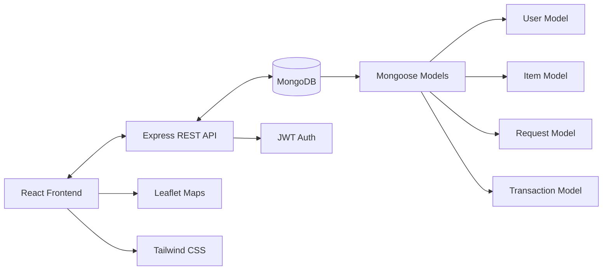
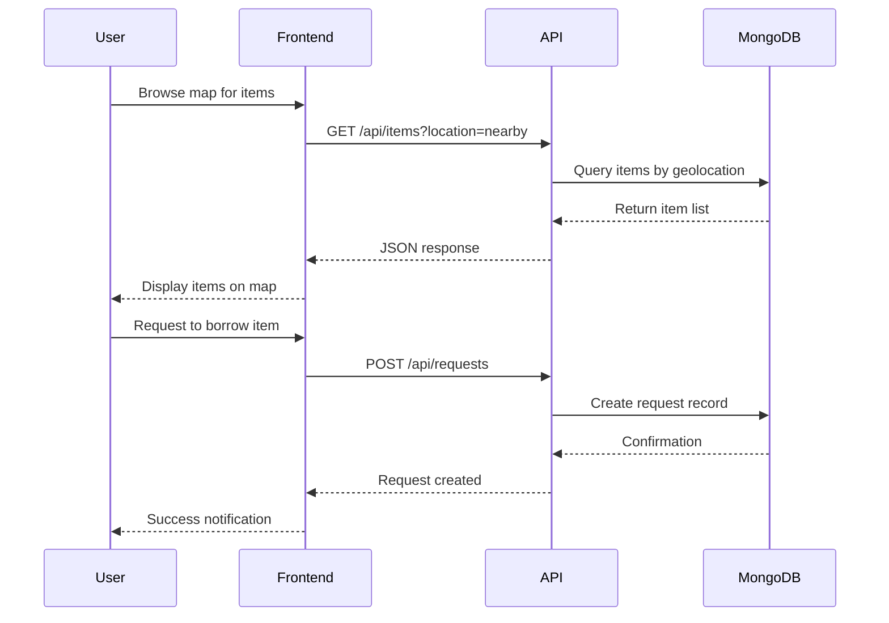
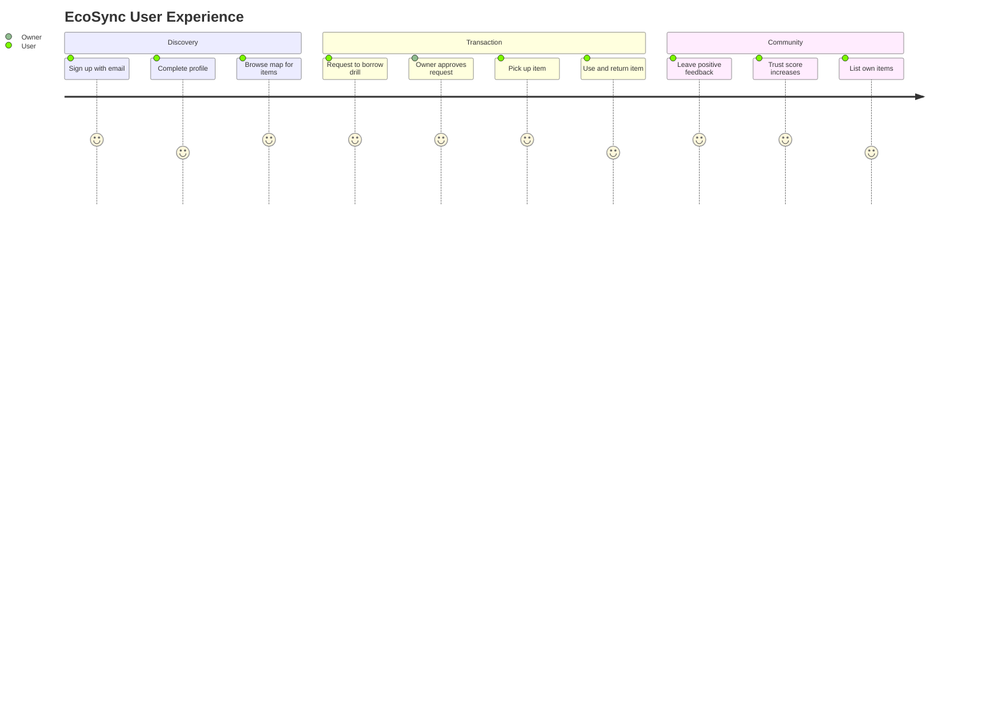

<!-- EcoSync Hero -->
<div align="center">
  
</div>

<div align="center">
  
</div>

<div align="center">
  
[](https://react.dev/)
[](https://nodejs.org/)
[](https://www.mongodb.com/)
[](https://tailwindcss.com/)
[](https://vitejs.dev/)
[](https://opensource.org/licenses/ISC)

</div>

<br>

```text
╔══════════════════════════════════════╗
║  PROJECT: EcoSync 🌱                 ║
║  TYPE: Hyperlocal P2P Marketplace    ║
║  MISSION: Sustainable Communities    ║
║  STATUS: Active Development          ║
║  LICENSE: ISC                        ║
╚══════════════════════════════════════╝
   
🎯 MISSION OBJECTIVES:
   └─ Foster Community Trust & Connection
   └─ Reduce Waste Through Sharing Economy
   └─ Enable Hyperlocal Item Discovery
   └─ Build Sustainable Neighborhoods
```

## 🌍 EcoSync — Connecting Communities, One Item at a Time

**EcoSync** is a hyperlocal peer-to-peer marketplace designed to revolutionize how neighbors share resources. We believe that the items gathering dust in your closet could be treasures for someone down the street. By enabling lending, borrowing, renting, and auctioning within local communities, we're building a more sustainable and connected world.

---

## 📖 Table of Contents

- [Features](#-features)
- [Technology Stack](#-technology-stack)
- [Architecture](#-architecture-overview)
- [Project Structure](#-project-structure)
- [Getting Started](#-getting-started)
  - [Prerequisites](#prerequisites)
  - [Installation](#installation)
  - [Environment Variables](#environment-variables)
- [API Documentation](#-api-architecture)
- [Contributing](#-contributing)
- [License](#-license)

---

## ✨ Features

### 🔐 User Authentication & Trust System
Secure JWT-based authentication with personalized profiles. Build your trust score through successful transactions and community engagement.

### 🗺️ Map-Based Discovery
Interactive Leaflet map displaying available items in your neighborhood. Visual clusters show item density, making discovery intuitive and engaging.

### 📦 Smart Item Listings
Create detailed listings with categories (Tools, Kitchen, Electronics, Sports, etc.), availability schedules, and flexible lending/renting terms.

### 🔍 Advanced Search & Filters
Filter items by category, distance radius, availability status, and transaction type. Find exactly what you need when you need it.

### 🤝 Transaction Management
Complete request-approval workflow with status tracking, notification system, and transaction history for both lenders and borrowers.

### 📱 Responsive Mobile Design
Mobile-first architecture ensures seamless experience across all devices, from smartphones to desktop browsers.

---

## 🛠️ Technology Stack

### Frontend (`ecosync-app`)

<div align="center">
  <a href="https://skillicons.dev">
    
  </a>
</div>

<div align="center">

| Tech | Description |
| :--- | :--- |
| **React 19** | Modern UI library for building interactive interfaces |
| **Vite** | Next-generation frontend tooling for lightning-fast builds |
| **Tailwind CSS 4** | Utility-first CSS framework for rapid UI development |
| **Framer Motion** | Production-ready animation library for React |
| **Leaflet & React Leaflet** | Mobile-friendly interactive maps |
| **React Router DOM** | Declarative routing for React applications |

</div>

### Backend (`ecosync-backend`)

<div align="center">
  <a href="https://skillicons.dev">
    
  </a>
</div>

<div align="center">

| Tech | Description |
| :--- | :--- |
| **Node.js** | JavaScript runtime built on Chrome's V8 engine |
| **Express.js** | Fast, unopinionated, minimalist web framework for Node.js |
| **MongoDB** | NoSQL database for flexible and scalable data storage |
| **Mongoose** | Elegant MongoDB object modeling for Node.js |
| **JWT** | JSON Web Tokens for secure authentication |
| **Bcrypt.js** | Library to help you hash passwords |

</div>

---

## 💡 Inspiration

The idea for **EcoSync** was born from a simple observation: our neighborhoods are full of underutilized resources. We realized that while one neighbor might need a drill for a 10-minute job, another neighbor has one gathering dust in their garage. We wanted to bridge this gap, fostering a sense of community while promoting sustainability.

## 🧠 Challenges We Ran Into

Building a hyperlocal marketplace came with its own set of unique challenges:

- **Geospatial Queries**: Implementing efficient location-based search using MongoDB's geospatial operators was tricky, especially when handling edge cases like users with no location data.
- **Real-time State Management**: Keeping the map state synchronized with the list view and ensuring that item availability updated in real-time required careful state management in React.
- **Trust & Safety**: Designing a trust score system that felt fair but robust against manipulation was a complex logic problem that required several iterations.

## 🏅 Accomplishments That We're Proud Of

- **Seamless Map Integration**: We successfully integrated Leaflet maps to provide a smooth, interactive discovery experience that feels native.
- **Robust Authentication**: Implementing a secure JWT-based auth system from scratch gave us a deep understanding of web security.
- **Clean UI/UX**: We're particularly proud of the clean, modern interface built with Tailwind CSS that makes the complex process of borrowing and lending feel simple.

## 📚 What We Learned

- **Full-Stack Integration**: Connecting a React frontend with an Express backend and ensuring smooth data flow taught us a lot about RESTful API design.
- **Database Design**: Structuring our MongoDB schemas to handle relationships between Users, Items, Requests, and Transactions was a great lesson in NoSQL data modeling.
- **Team Collaboration**: Working together on a complex project under time constraints helped us refine our git workflow and communication skills.

---

## 🏗️ Architecture Overview



---

## 📂 Project Structure

```
Hackxios/
├── ecosyc/
│   ├── ecosync-app/              # Frontend React Application
│   │   ├── src/
│   │   │   ├── components/       # Reusable UI components
│   │   │   ├── pages/            # Page-level components
│   │   │   ├── services/         # API integration
│   │   │   ├── context/          # React Context (Auth)
│   │   │   └── assets/           # Static assets
│   │   └── public/               # Public assets
│   │
│   └── ecosync-backend/          # Backend Node.js/Express API
│       ├── controllers/          # Business logic
│       ├── models/               # MongoDB schemas
│       ├── routes/               # API routes
│       ├── middleware/           # Auth & validation
│       └── config/               # Database configuration
│
└── README.md                     # Project Documentation
```

---

## 🏁 Getting Started

Follow these steps to get a local copy up and running.

### Prerequisites

Ensure you have the following installed:
- **Node.js** (v18 or higher recommended)
- **npm** (v9 or higher) or **yarn**
- **MongoDB** (Local installation or MongoDB Atlas account)

### Installation

1.  **Clone the repository**
    ```bash
    git clone https://github.com/yourusername/Hackxios.git
    cd Hackxios
    ```

2.  **Setup Backend**
    ```bash
    cd ecosyc/ecosync-backend
    npm install
    ```

3.  **Setup Frontend**
    ```bash
    cd ../ecosync-app
    npm install
    ```

### Environment Variables

You need to set up environment variables for the backend to function correctly.

1.  Create a `.env` file in `ecosyc/ecosync-backend/`.
2.  Add the following variables:

    ```env
    # Server Configuration
    PORT=5000

    # Database Configuration
    MONGO_URI=mongodb+srv://<username>:<password>@cluster0.mongodb.net/ecosync?retryWrites=true&w=majority

    # Security
    JWT_SECRET=your_super_secret_jwt_key_here
    ```

### Running the Application

1.  **Start the Backend Server**
    ```bash
    # In ecosyc/ecosync-backend
    npm run dev
    ```
    The server will start on `http://localhost:5000`.

2.  **Start the Frontend Application**
    ```bash
    # In ecosyc/ecosync-app
    npm run dev
    ```
    The application will be available at `http://localhost:5173`.

---

## 🔌 API Architecture

The backend provides RESTful API endpoints for complete platform functionality:

| Endpoint | Purpose | Methods |
|----------|---------|---------|
| `/api/auth` | User authentication (Login, Register) | POST |
| `/api/users` | Profile management and trust scores | GET, PUT |
| `/api/items` | Item CRUD operations | GET, POST, PUT, DELETE |
| `/api/requests` | Borrow/Rent request handling | GET, POST, PUT |
| `/api/transactions` | Transaction history and tracking | GET, POST |

### Example API Flow


---

## 🛣️ User Journey



---

## 🤝 Contributing

We welcome contributions from developers passionate about sustainability and community building!

1. **Fork** the repository
2. **Create** a feature branch (`git checkout -b feature/AmazingFeature`)
3. **Commit** your changes (`git commit -m 'Add some AmazingFeature'`)
4. **Push** to the branch (`git push origin feature/AmazingFeature`)
5. **Open** a Pull Request

---

## 📄 License

This project is licensed under the **ISC License**.

---

<div align="center">
  
</div>
